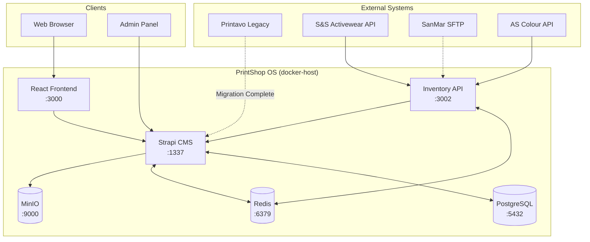
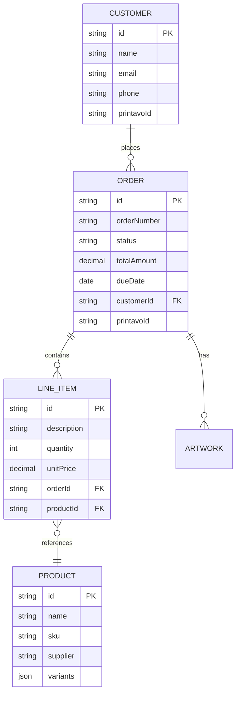
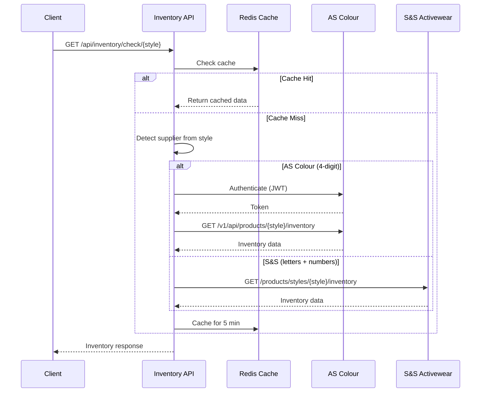
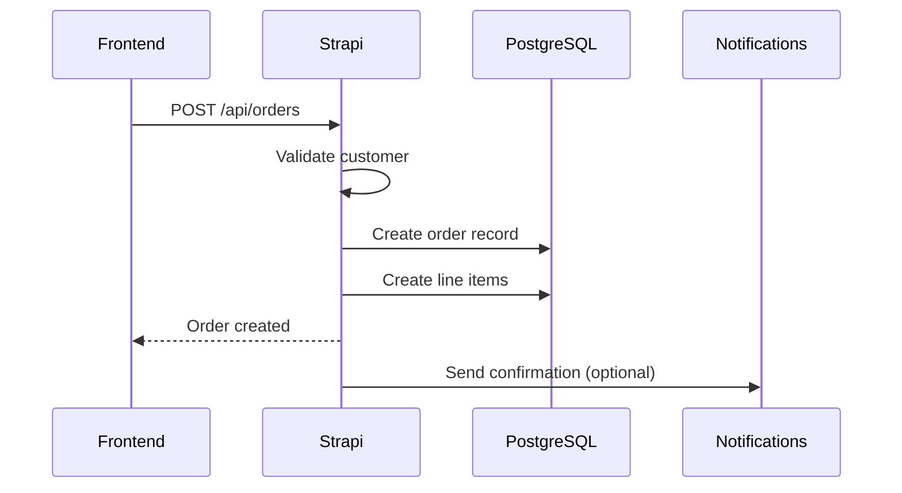

# PrintShop OS - Architecture Overview

> **Last Updated:** November 28, 2025  
> **Status:** Production - Frontend Deployed  
> **Maintainer:** @ronnyworks

---

## System Context

PrintShop OS is an enterprise print shop management platform replacing Printavo SaaS. The system handles order management, customer relationships, supplier inventory integration, and production workflow.



---

## Container Architecture

All services run on `docker-host` (100.92.156.118) via Docker.

| Service | Container | Port | URL | Status |
|---------|-----------|------|-----|--------|
| **React Frontend** | `printshop-frontend` | 3000 | `mintprints-app.ronny.works` | ✅ Running |
| **Strapi CMS** | `printshop-strapi` | 1337 | `mintprints.ronny.works` | ✅ Running |
| **PostgreSQL** | `printshop-postgres` | 5432 | Internal | ✅ Running |
| **Redis** | `printshop-redis` | 6379 | Internal | ✅ Running |
| **Inventory API** | `printshop-api` | 3002 | Internal | ✅ Running |
| **MinIO** | `minio` | 9000/9001 | Internal | ✅ Running |
| **Traefik** | `traefik` | 80/443/8080 | Reverse Proxy | ✅ Running |

### Access URLs

| Service | Direct Access (Tailscale) | HTTPS (Cloudflare Tunnel) |
|---------|---------------------------|---------------------------|
| Frontend | http://100.92.156.118:3000 | https://mintprints-app.ronny.works |
| Strapi API | http://100.92.156.118:1337 | https://mintprints.ronny.works |
| Strapi Admin | http://100.92.156.118:1337/admin | https://mintprints.ronny.works/admin |
| Inventory API | http://100.92.156.118:3002 | Internal only |
| MinIO Console | http://100.92.156.118:9001 | Internal only |
| Traefik Dashboard | http://100.92.156.118:8080 | Internal only |

### Network Topology

```
┌─────────────────────────────────────────────────────────────────┐
│ docker-host (100.92.156.118)                                    │
│                                                                 │
│  ┌─────────────┐    ┌─────────────┐    ┌─────────────┐         │
│  │  Traefik    │────│  Frontend   │────│   Strapi    │         │
│  │  :80/:443   │    │   :3000     │    │   :1337     │         │
│  └─────────────┘    └─────────────┘    └──────┬──────┘         │
│         │                                      │                │
│  ┌──────┴──────┐    ┌─────────────┐    ┌──────┴──────┐         │
│  │ Inventory   │    │  PostgreSQL │    │    Redis    │         │
│  │ API :3002   │    │    :5432    │    │    :6379    │         │
│  └─────────────┘    └─────────────┘    └─────────────┘         │
│                                                                 │
│  Network: homelab-network (external)                            │
└─────────────────────────────────────────────────────────────────┘
```

---

## Data Model

### Core Entities (Strapi)

| Entity | Records | Description |
|--------|---------|-------------|
| **Orders** | 12,854 | Sales orders and quotes |
| **Customers** | 3,317 | Customer accounts |
| **Line Items** | 49,216 | Order line items with product details |
| **Products** | 710 | Top product catalog entries |

### Entity Relationships



---

## Key Workflows

### 1. Supplier Inventory Check

Real-time inventory lookup across multiple suppliers.



### 2. Order Creation Flow



---

## Supplier Integrations

### Configured Suppliers

| Supplier | Auth Method | Endpoint | Status |
|----------|-------------|----------|--------|
| **AS Colour** | JWT + Subscription-Key | `us.api.ascolour.com` | ✅ Working |
| **S&S Activewear** | API Key + Account | `api.ssactivewear.com` | ✅ Configured |
| **SanMar** | SFTP (Username/Password) | SFTP Server | ⚠️ Needs sync |

### AS Colour Authentication (Dual-Auth)

AS Colour requires both:
1. `Ocp-Apim-Subscription-Key` header (API key)
2. `Authorization: Bearer {jwt}` header (from email/password login)

```typescript
// Authentication flow
const authResponse = await fetch('https://us.api.ascolour.com/v1/api/authentication', {
  method: 'POST',
  headers: { 'Ocp-Apim-Subscription-Key': subscriptionKey },
  body: JSON.stringify({ email, password })
});
const { token } = await authResponse.json();
// Token valid for 24 hours, refresh at 23 hours
```

---

## Deployment View

### Infrastructure

| Host | Role | IP (Tailscale) | Storage |
|------|------|----------------|---------|
| **macbook** | Development | 100.85.186.7 | Local |
| **pve** | Proxmox hypervisor | 100.96.211.33 | ZFS pools |
| **docker-host** | Container host | 100.92.156.118 | Mounted from pve |

### Volume Mounts

```
/mnt/primary/docker/volumes/printshop-os/
├── postgres/          # PostgreSQL data
├── redis/             # Redis persistence
├── strapi/            # Strapi uploads
└── artwork/           # Artwork files (synced from MinIO)
```

### Quick Commands

```bash
# SSH to docker-host
ssh docker-host

# View container status
docker ps --format "table {{.Names}}\t{{.Status}}\t{{.Ports}}"

# View logs
docker logs printshop-strapi --tail 100 -f

# Restart service
docker restart printshop-strapi

# Deploy updates from macbook
rsync -avz --exclude node_modules --exclude .git . docker-host:~/stacks/printshop-os/
ssh docker-host 'cd ~/stacks/printshop-os && docker-compose up -d --build'
```

---

## API Reference

### Strapi Endpoints

| Endpoint | Method | Description |
|----------|--------|-------------|
| `/api/orders` | GET/POST | Order management |
| `/api/customers` | GET/POST | Customer records |
| `/api/line-items` | GET/POST | Line item management |
| `/api/products` | GET/POST | Product catalog |

### Inventory API Endpoints

| Endpoint | Method | Description |
|----------|--------|-------------|
| `/health` | GET | Health check, shows configured suppliers |
| `/api/inventory/check/{style}` | GET | Get inventory for style |
| `/api/inventory/bulk` | POST | Bulk inventory check |

---

## Security

### Credentials Management

- All secrets stored in `.env` files (gitignored)
- Strapi API tokens for programmatic access
- Supplier credentials isolated per service

### API Authentication

```bash
# Strapi API Token (Full Access)
Authorization: Bearer {STRAPI_TOKEN}

# Inventory API (no auth required - internal network)
curl http://docker-host:3002/api/inventory/check/5001
```

---

## Monitoring

### Health Checks

```bash
# All services health
ssh docker-host 'docker ps --format "table {{.Names}}\t{{.Status}}"'

# Strapi health
curl -s http://docker-host:1337/_health

# Inventory API health
curl -s http://docker-host:3002/health

# PostgreSQL health
ssh docker-host 'docker exec printshop-postgres pg_isready -U strapi'
```

### Logs

```bash
# Dozzle (web-based log viewer)
http://docker-host:9999

# CLI logs
ssh docker-host 'docker logs printshop-strapi -f --tail 100'
```

---

## Gap Analysis

### Completed ✅

1. **Data Migration**: All Printavo data imported to Strapi (3,317 customers, 12,854+ orders)
2. **Supplier API**: Inventory API deployed with AS Colour working (dual-auth)
3. **Infrastructure**: Docker containers running on homelab
4. **Frontend**: React frontend deployed (dark mode, production schedule view)
5. **SSL/HTTPS**: Cloudflare Tunnel configured for mintprints.ronny.works
6. **Health Monitoring**: health-check.sh with auto-recovery and ntfy notifications

### In Progress 🔄

1. **Data Import**: robust-import.py running with progress bars, checkpoints, retry logic
2. **SanMar SFTP**: Needs initial sync to populate product cache

### Not Started 🔴

1. **Production Dashboard**: Real-time WebSocket order tracking
2. **Automated Backups**: PostgreSQL backup scripts
3. **Email Notifications**: Customer order updates

---

## Recent Changes (Nov 28, 2025)

- Added `printavoCustomerId` and `visualId` fields to Order schema
- Fixed line-item schema with proper `order` and `imprints` relations
- Created `scripts/config.py` - canonical configuration
- Created `scripts/robust-import.py` - import with progress bars, retry, checkpoints
- Created `scripts/health-check.sh` - auto-recovery monitoring
- Created `scripts/check-import.sh` - quick status check

---

<small>Generated with GitHub Copilot as directed by @ronnyworks</small>
