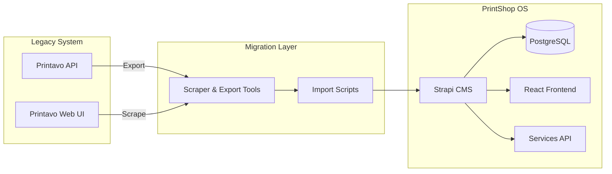

# Printavo Migration Status

> **Last Updated:** November 27, 2025  
> **Goal:** Complete removal of Printavo dependency → Full PrintShop OS operation

---

## System Context



---

## Data Import Progress

| Entity | Source Total | Imported | Completion | Status |
|--------|-------------|----------|------------|--------|
| **Orders** | 12,867 | 12,854 | 100% | ✅ Complete |
| **Customers** | 3,317 | 3,317 | 100% | ✅ Complete |
| **Line Items** | 44,158 | 49,216 | 100% | ✅ Complete |
| **Products** | 1,752 | 710 | 41% | ✅ Top 500+ imported |
| **Artwork Files** | ~12,867 orders | 510/12,867 | 4% | 🔄 **SCRAPING** (~12 GB) |

### Live Progress Tracking

```bash
# Monitor artwork scrape progress:
tail -f data/artwork/scrape.log

# Check progress
ls data/artwork/by_order | wc -l
du -sh data/artwork/

# Check Strapi counts (from docker-host):
for e in orders customers line-items products; do
  curl -s "http://localhost:1337/api/${e}?pagination%5BpageSize%5D=1" \
    -H "Authorization: Bearer $TOKEN" | grep -o "total\":[0-9]*"
done
```

---

## Supplier Integration Status ✅ DEPLOYED

**API Service:** `http://docker-host:3002` (port 3002 to avoid uptime-kuma conflict)

| Supplier | Status | Auth Method | Notes |
|----------|--------|-------------|-------|
| **AS Colour** | ✅ Working | Subscription-Key + JWT | Tested: 1.2M units for style 5001 |
| **S&S Activewear** | ✅ Configured | API Key + Account | Detection working |
| **SanMar** | ⚠️ SFTP Pending | SOAP + SFTP | Needs initial sync |

### Test Commands

```bash
# AS Colour - Staple Tee
curl http://docker-host:3002/api/inventory/check/5001

# Health check (shows all configured suppliers)
curl http://docker-host:3002/health

# S&S Activewear (example)
curl http://docker-host:3002/api/inventory/check/PC54
```

---

## Top Products Analysis

From 44,132 line items across 12,854 orders, we identified **1,752 unique products**.

### Top 20 Products by Order Volume

| Rank | Style Code | Total Units | Description |
|------|------------|-------------|-------------|
| 1 | NL3600 | 1,952 | Next Level Apparel - Unisex Cotton Tee |
| 2 | G2000 | 860 | Gildan - Ultra Cotton Adult Tee |
| 3 | B3001 | 612 | Bella+Canvas - Unisex Jersey Short Sleeve |
| 4 | AL1301 | 566 | Client Supplied White Alstyle tee |
| 5 | IND400 | 399 | Independent Trading Co. - Heavyweight Hoodie |
| 6 | 1801GD | 314 | Los Angeles Apparel - S/S Garment Dye |
| 7 | SM0100 | 242 | Paragon - Adult Solid Mesh Polo |
| 8 | G5000 | 214 | Gildan Heavy Cotton Tee |
| 9 | SM0210 | 198 | Paragon - Long Islander Performance LS |
| 10 | 1717 | 178 | Comfort Colors - Heavyweight Tee |
| 11 | CC1717 | 151 | Comfort Colors Tee |
| 12 | 1301 | 144 | American Apparel - Heavyweight Cotton |
| 13 | NL6010 | 144 | Next Level Triblend Short Sleeve Crew |
| 14 | G18500 | 141 | Gildan - Heavy Blend Hooded Sweatshirt |
| 15 | G2400 | 126 | Gildan Ultra Cotton Adult Long Sleeve |
| 16 | NL3601 | 126 | Next Level Men's Cotton Long Sleeve |
| 17 | NL1533 | 122 | Next Level - Women's Ideal Racerback Tank |
| 18 | 5000 | 121 | Gildan Unisex Heavy Cotton T-Shirt |
| 19 | NL6210 | 117 | Next Level - CVC tee |
| 20 | 3001 | 106 | BELLA + CANVAS - Jersey Tee |

**Top 500 products account for 13,045 units ordered** - these will be pre-populated for quick access.

---

## Migration Phases

### Phase 1: Data Export ✅ Complete
- [x] Full Printavo API export (12,854 orders)
- [x] Customer data export (3,317 customers)
- [x] Order with line items export

### Phase 2: Core Import ⚠️ In Progress
- [x] Customer import to Strapi
- [x] Order import to Strapi
- [x] Product catalog (top 500) ✅
- [ ] Line item import (~14% remaining)

### Phase 3: Artwork Archival 🔄 IN PROGRESS (Started 2025-11-27 ~19:30)

**Scrapers:** 
- `scripts/printavo-artwork-scraper-v2.py` - **PRIMARY** (customer-organized, dual-indexed)
- `scripts/printavo-artwork-scraper.py` - Legacy v1

**Key Findings:**
- Printavo REST API does NOT expose artwork files
- Files stored on `cdn.filepicker.io` (Filestack CDN)
- Web scraping required using session authentication
- Full-size images extracted from Filestack transform URLs

**Storage Structure:**
```
data/artwork/
├── by_customer/                  # PRIMARY - for customer reorders
│   └── {customer-slug}-{id}/
│       └── {year}/
│           └── {visual_id}_{nickname}/
│               ├── artwork_1.png
│               └── order.json (metadata)
│
├── by_order/                     # SECONDARY - symlinks for order lookup
│   └── {visual_id} → symlink to customer folder
│
├── index.json                    # Searchable master index
├── checkpoint.json               # Resume position
└── scrape.log                    # Progress log
```

**Current Progress:**
```bash
# Monitor progress:
tail -f data/artwork/scrape.log

# Check checkpoint:
cat data/artwork/checkpoint.json | jq '{processed: .last_order_index, total: 12867}'
```

**After Scrape Completes:**
```bash
# Sync to MinIO for web access:
./scripts/sync-artwork-to-minio.sh

# Access artwork:
# - MinIO Console: http://docker-host:9001
# - S3 API: http://docker-host:9000/artwork-archive/
# - Local: data/artwork/by_customer/ or by_order/
```

- [x] Artwork scraper v2 built ✅
- [x] Test scrape (8 orders = 57 files = 98 MB) ✅
- [x] MinIO bucket created ✅
- [x] Sync script ready ✅
- [🔄] Full scrape running (~7 hours, ~150 GB)

### Phase 4: Feature Parity 🔴 Not Started
- [ ] Quote creation workflow
- [ ] Order status management
- [ ] Invoice generation
- [ ] Production tracking

---

## Supplier Integration Status

### Inventory API (`services/api/src/inventory/`)

| Supplier | Client Built | API Connected | Caching |
|----------|-------------|---------------|---------|
| AS Colour | ✅ | TBD credentials | ✅ Redis 15-min |
| S&S Activewear | ✅ | TBD credentials | ✅ Redis 15-min |
| SanMar | ✅ | TBD credentials | ✅ Redis 15-min |

**Endpoints:**
- `GET /api/inventory/check/:sku` - Check single SKU
- `GET /api/inventory/check/:sku/color/:color` - SKU with color variant
- `POST /api/inventory/batch` - Batch check multiple SKUs
- `GET /api/inventory/health` - Health check

---

## Infrastructure

### Production (docker-host @ 100.92.156.118)

| Container | Status | Purpose |
|-----------|--------|---------|
| printshop-strapi | ✅ Running | Headless CMS |
| printshop-postgres | ✅ Running | Database |
| printshop-redis | ✅ Running | Caching |

### Data Locations

| Path | Contents |
|------|----------|
| `data/raw/printavo-exports/` | Raw Printavo JSON exports |
| `data/processed/` | Transformed data for import |
| `data/strapi-imports/` | Import-ready JSON |
| `scripts/` | Import and scraping scripts |

---

## Printavo UX Replication Goals

### Must Replicate
1. **Quick Quote Creation** - Type style code → auto-populate product details
2. **Visual Order Board** - Kanban-style production tracking
3. **Customer Portal** - View and approve quotes
4. **Invoice/Packing Slip PDFs**

### Must Improve
1. **Inventory Integration** - Real-time supplier stock (Printavo lacks this)
2. **Smart Pricing** - Dynamic pricing engine based on quantity/complexity
3. **Better Search** - Full-text search across orders, customers, products
4. **Mobile-First** - Responsive design for shop floor

---

## Next Actions

1. **Monitor Artwork Scrape** - `tail -f data/artwork/scrape.log` (~7 hours)
2. **Sync to MinIO** - After scrape: `./scripts/sync-artwork-to-minio.sh`
3. **Complete Line Item Import** - ~6,000 remaining (~14%)
4. **Supplier Credentials** - Set up API access for AS Colour, S&S, SanMar

---

## Data Flow for Client Assets

```
┌─────────────────────────────────────────────────────────────────┐
│                     ARTWORK DATA FLOW                            │
├─────────────────────────────────────────────────────────────────┤
│                                                                  │
│  Printavo Web UI                                                │
│       │                                                          │
│       ▼                                                          │
│  printavo-artwork-scraper-v2.py (Python + BeautifulSoup)        │
│       │                                                          │
│       ├── Downloads from cdn.filepicker.io (Filestack)          │
│       │                                                          │
│       ▼                                                          │
│  data/artwork/                                                   │
│       ├── by_customer/{slug}/{year}/{order}/  (actual files)    │
│       ├── by_order/{visual_id} → symlinks                       │
│       └── index.json (searchable metadata)                      │
│       │                                                          │
│       ▼                                                          │
│  sync-artwork-to-minio.sh (rsync over SSH)                      │
│       │                                                          │
│       ▼                                                          │
│  MinIO (docker-host:9000/artwork-archive)                       │
│       │                                                          │
│       ├── Web Console: http://docker-host:9001                  │
│       └── S3 API: http://docker-host:9000/artwork-archive/      │
│                                                                  │
└─────────────────────────────────────────────────────────────────┘

LOOKUP METHODS:
• Customer reorder: Browse by_customer/{customer-slug}/
• Order lookup: Direct to by_order/{visual_id}/
• Search: Query index.json for customer/order metadata
```

---

## Information Requested (TBD)

- [x] ~~Printavo artwork storage structure~~ → Uses Filestack CDN, requires web scraping
- [ ] Required supplier API credentials and accounts
- [ ] Priority features for MVP launch date

---

<small>Generated with GitHub Copilot as directed by @ronnyworks</small>
