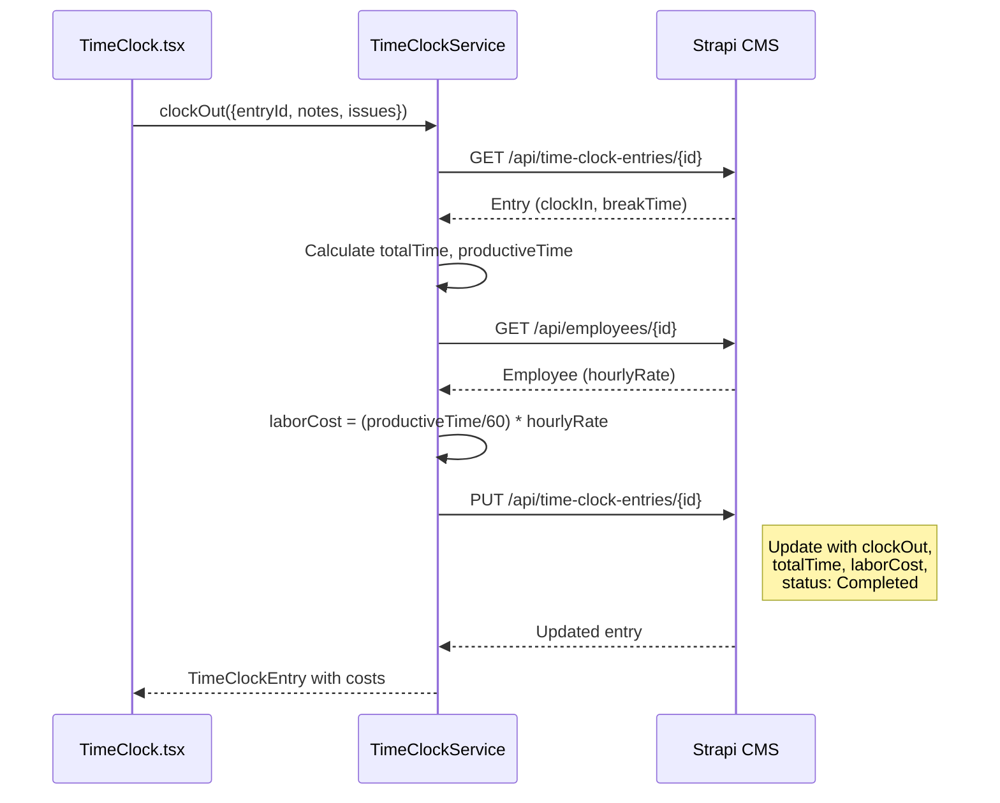

# Production Dashboard - Architecture Overview

> **Scope**: Time clock, SOP library, job queue, analytics for production floor team.  
> **Status**: 85% Complete - Missing Strapi content types for `employee` and `time-clock-entry`

---

## System Context

The Production Dashboard enables shop floor employees to clock in/out with PIN authentication, track time against jobs, access SOPs, and view productivity metrics. Supervisors use it for team oversight and approval workflows.

```mermaid src="./diagrams/production-dashboard-architecture.mmd" alt="Production Dashboard System Architecture"```

### Key Actors

| Actor | Description | Primary Actions |
|-------|-------------|-----------------|
| **Operator** | Production floor employee | Clock in/out, view SOPs, complete checklists |
| **Supervisor** | Team lead | Approve time edits, view team metrics, manage SOPs |
| **Admin** | Shop manager | Configure system, export reports, manage employees |

---

## Container Architecture

### Frontend Components

| Component | Location | Status | Description |
|-----------|----------|--------|-------------|
| `TimeClock.tsx` | `frontend/src/components/production/` | ✅ Complete | PIN pad, job selector, clock in/out UI |
| `SOPLibrary.tsx` | `frontend/src/components/production/` | ✅ Complete | Searchable SOP library with categories |
| `SOPViewer.tsx` | `frontend/src/components/production/` | ✅ Complete | Step-by-step SOP display |
| `MetricsDashboard.tsx` | `frontend/src/components/production/` | ✅ Complete | Efficiency charts, leaderboard |
| `Checklist.tsx` | `frontend/src/components/production/` | ✅ Complete | Press-ready quality checklists |
| `Leaderboard.tsx` | `frontend/src/components/production/` | ✅ Complete | Employee productivity rankings |

### Backend Services

| Service | Port | Location | Status |
|---------|------|----------|--------|
| Production Dashboard API | 3001 | `services/production-dashboard/` | ✅ Running |
| WebSocket Server | 3001 | `services/production-dashboard/src/websocket/` | ✅ Running |
| Strapi CMS | 1337 | `printshop-strapi/` | ⚠️ Missing content types |

---

## Key Workflows

### 1. Employee Clock-In Flow

```mermaid src="./diagrams/time-clock-sequence.mmd" alt="Time Clock Clock-In Flow"```

**Failure Modes:**
- `401 Unauthorized` - Invalid PIN
- `409 Conflict` - Employee already clocked in
- `404 Not Found` - Employee or Job not found
- `503 Service Unavailable` - Strapi connection failed

### 2. Clock-Out with Labor Cost Calculation



### 3. Break Pause/Resume Flow

| Action | Endpoint | Status Change | Break Time Update |
|--------|----------|---------------|-------------------|
| Pause | `POST /pause` | Active → Paused | Sets `pausedAt` |
| Resume | `POST /resume` | Paused → Active | Adds elapsed pause to `breakTime` |

---

## API Interface Specification

### Time Clock Endpoints

| Method | Endpoint | Request Body | Response | Auth |
|--------|----------|--------------|----------|------|
| `POST` | `/api/production/time-clock/clock-in` | `{employeeId, employeePin, jobId, taskType, machineId?}` | `TimeClockEntry` | PIN |
| `POST` | `/api/production/time-clock/clock-out` | `{entryId, notes?, issues?}` | `TimeClockEntry` | - |
| `POST` | `/api/production/time-clock/pause` | `{entryId}` | `TimeClockEntry` | - |
| `POST` | `/api/production/time-clock/resume` | `{entryId}` | `TimeClockEntry` | - |
| `GET` | `/api/production/time-clock/active` | - | `TimeClockEntry[]` | - |
| `GET` | `/api/production/time-clock/employee/:id` | - | `TimeClockEntry[]` | - |
| `PUT` | `/api/production/time-clock/edit` | `{entryId, clockIn?, clockOut?, breakTime?, editedById, editReason}` | `TimeClockEntry` | Supervisor |
| `POST` | `/api/production/time-clock/approve` | `{entryId, approvedById, approved}` | `TimeClockEntry` | Supervisor |

### SOP Endpoints

| Method | Endpoint | Request Body | Response |
|--------|----------|--------------|----------|
| `GET` | `/api/production/sops` | - | `{sops[], total, limit, offset}` |
| `GET` | `/api/production/sops/:id` | - | `SOP` (increments viewCount) |
| `GET` | `/api/production/sops/search` | `?q=&category=&difficulty=` | `{sops[], total}` |
| `POST` | `/api/production/sops` | `SOPCreateInput` | `SOP` |
| `PUT` | `/api/production/sops/:id` | `SOPUpdateInput` | `SOP` |
| `DELETE` | `/api/production/sops/:id` | - | `boolean` |
| `POST` | `/api/production/sops/:id/favorite` | `{userId}` | `SOP` |
| `GET` | `/api/production/sops/analytics` | - | `SOPAnalytics` |

### Analytics Endpoints

| Method | Endpoint | Query Params | Response |
|--------|----------|--------------|----------|
| `GET` | `/api/production/analytics/overview` | `?period=today\|week\|month` | `DashboardOverview` |
| `GET` | `/api/production/analytics/employee/:id` | `?period=` | `EmployeeMetrics` |
| `GET` | `/api/production/analytics/team` | `?period=` | `TeamMetrics` |
| `GET` | `/api/production/analytics/leaderboard` | `?period=` | `LeaderboardEntry[]` |
| `GET` | `/api/production/analytics/efficiency` | `?groupBy=day\|week\|month` | `TrendDataPoint[]` |
| `GET` | `/api/production/analytics/alerts` | - | `Alert[]` |

---

## Data Model

```mermaid src="./diagrams/production-dashboard-erd.mmd" alt="Production Dashboard Entity Relationships"```

### Employee Schema (TO BE CREATED)

```json
{
  "kind": "collectionType",
  "collectionName": "employees",
  "attributes": {
    "firstName": { "type": "string", "required": true },
    "lastName": { "type": "string", "required": true },
    "email": { "type": "email", "unique": true },
    "pin": { "type": "string", "private": true },
    "hourlyRate": { "type": "decimal", "default": 20.00 },
    "role": { "type": "enumeration", "enum": ["operator", "supervisor", "admin"], "default": "operator" },
    "isActive": { "type": "boolean", "default": true }
  }
}
```

### Time Clock Entry Schema (TO BE CREATED)

```json
{
  "kind": "collectionType",
  "collectionName": "time_clock_entries",
  "attributes": {
    "employee": { "type": "relation", "relation": "manyToOne", "target": "api::employee.employee" },
    "job": { "type": "relation", "relation": "manyToOne", "target": "api::job.job" },
    "taskType": { "type": "enumeration", "enum": ["setup", "production", "cleanup", "break"] },
    "machineId": { "type": "string" },
    "clockIn": { "type": "datetime", "required": true },
    "clockOut": { "type": "datetime" },
    "pausedAt": { "type": "datetime" },
    "totalTime": { "type": "integer", "default": 0 },
    "breakTime": { "type": "integer", "default": 0 },
    "productiveTime": { "type": "integer", "default": 0 },
    "laborCost": { "type": "decimal", "default": 0 },
    "notes": { "type": "text" },
    "issues": { "type": "text" },
    "editedBy": { "type": "relation", "relation": "manyToOne", "target": "api::employee.employee" },
    "editApprovedBy": { "type": "relation", "relation": "manyToOne", "target": "api::employee.employee" },
    "editReason": { "type": "text" },
    "status": { "type": "enumeration", "enum": ["Active", "Paused", "Completed", "Edited", "PendingApproval"], "default": "Active" }
  }
}
```

---

## WebSocket Events

| Event | Direction | Payload | Description |
|-------|-----------|---------|-------------|
| `employee:clocked-in` | Server → Client | `{employeeId, entryId, jobId}` | Broadcast when employee clocks in |
| `employee:clocked-out` | Server → Client | `{employeeId, entryId, laborCost}` | Broadcast when employee clocks out |
| `timer:update` | Server → Client | `{entryId, elapsedTime}` | Periodic timer sync |
| `timer:pause` | Server → Client | `{entryId}` | Timer paused for break |
| `timer:resume` | Server → Client | `{entryId}` | Timer resumed after break |
| `job:status-changed` | Server → Client | `{jobId, newStatus}` | Job status updated |

---

## Gap Analysis

### Critical Gaps (Blocking)

| Gap | Impact | Resolution |
|-----|--------|------------|
| ❌ `employee` content type missing | Cannot authenticate PINs or track hourly rates | Create Strapi content type |
| ❌ `time-clock-entry` content type missing | Cannot persist clock in/out data | Create Strapi content type |

### Non-Critical Gaps

| Gap | Impact | Resolution |
|-----|--------|------------|
| ⚠️ SOP content in memory only | SOPs lost on service restart | Wire to Strapi `sop` content type |
| ⚠️ No employee import script | Manual employee creation | Create import script from Printavo |
| ⚠️ Analytics uses mock data | Metrics not accurate | Connect to real time entries |

---

## Test Coverage

| Component | Test File | Tests | Status |
|-----------|-----------|-------|--------|
| TimeClockService | `src/__tests__/time-clock.test.ts` | 20+ | ✅ |
| SOPService | `src/__tests__/sop.test.ts` | 25+ | ✅ |
| MetricsService | `src/__tests__/analytics.test.ts` | 28+ | ✅ |
| API Integration | `__tests__/api.test.ts` | 15+ | ✅ |

---

## Deployment View

| Component | Environment | Port | Status |
|-----------|-------------|------|--------|
| Production Dashboard API | Local | 3001 | ✅ Ready |
| Strapi CMS | Local | 1337 | ⚠️ Needs content types |
| Frontend | Local | 5173 | ✅ Ready |

### Environment Variables

```bash
# Production Dashboard Service
PORT=3001
STRAPI_URL=http://localhost:1337
STRAPI_TOKEN=<api-token>
DEFAULT_HOURLY_RATE=20.00

# Strapi CMS
DATABASE_CLIENT=sqlite
DATABASE_FILENAME=.tmp/data.db
```

---

## Information Requested

- **TBD**: Should employees be imported from Printavo or created fresh?
- **TBD**: What is the default hourly rate for operators?
- **TBD**: Should time clock entries sync back to Printavo?
- **TBD**: Are there multiple machines that need tracking?

---

<small>Generated with GitHub Copilot as directed by @ronnyworks</small>
