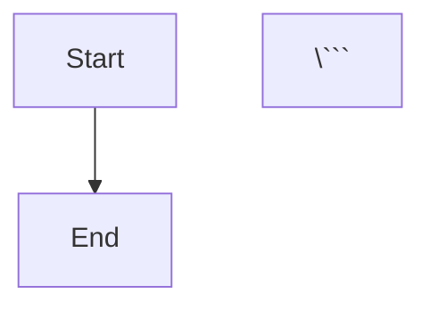

# PrintShop OS - Architecture Diagrams

This directory contains Mermaid diagram files for the PrintShop OS architecture.

## Diagram Files

### System Context
**File:** `system-context.mmd`  
**Description:** High-level view of PrintShop OS ecosystem showing external systems, core services, and data layer.

**View:** Render in [Mermaid Live Editor](https://mermaid.live/) or GitHub

### Component Architecture
**File:** `component-architecture.mmd`  
**Description:** Detailed view of Strapi CMS internal structure showing content types, controllers, services, and data storage.

### Data Flows

#### Order Creation Flow
**File:** `data-flow-order-creation.mmd`  
**Description:** Sequence diagram showing customer order creation, queue processing, and production team notification.

#### Time Clock Flow
**File:** `data-flow-time-clock.mmd`  
**Description:** Sequence diagram showing employee clock in/out process with real-time WebSocket updates and labor cost calculation.

#### AI Quote Optimization Flow
**File:** `data-flow-ai-quote.mmd`  
**Description:** Sequence diagram showing AI-powered design analysis using OpenAI GPT-4 Vision with caching strategy.

#### Supplier Sync Flow
**File:** `data-flow-supplier-sync.mmd`  
**Description:** Flowchart showing supplier data synchronization with caching, fuzzy matching, and JSONL persistence.

### Security
**File:** `security-auth-flow.mmd`  
**Description:** Flowchart showing JWT authentication and role-based authorization flow.

## Viewing Diagrams

### In GitHub
All `.mmd` files render automatically in GitHub's web interface.

### Locally
Use one of these tools:
- **VS Code:** Install [Markdown Preview Mermaid Support](https://marketplace.visualstudio.com/items?itemName=bierner.markdown-mermaid)
- **Browser:** Open in [Mermaid Live Editor](https://mermaid.live/)
- **CLI:** Use [mermaid-cli](https://github.com/mermaid-js/mermaid-cli) to generate PNG/SVG

### Generate Images
```bash
# Install mermaid-cli
npm install -g @mermaid-js/mermaid-cli

# Generate PNG
mmdc -i system-context.mmd -o system-context.png

# Generate SVG (vector, recommended)
mmdc -i system-context.mmd -o system-context.svg
```

## Embedding in Documentation

### Markdown
```markdown


### Inline Reference
```markdown

```

## Updating Diagrams

1. Edit `.mmd` files directly
2. Test in [Mermaid Live Editor](https://mermaid.live/)
3. Update corresponding sections in `ARCHITECTURE_OVERVIEW.md`
4. Commit changes

## Diagram Standards

- Use emojis for visual clarity (🖨️, 👥, 📦, etc.)
- Include port numbers for services
- Use consistent color schemes:
  - Services: `#e1f5ff` (light blue)
  - External: `#fff4e6` (light orange)
  - Data: `#f3e5f5` (light purple)
  - Success: `#4caf50` (green)
  - Error: `#f44336` (red)
  - Warning: `#ff9800` (orange)

## Related Documentation

- [ARCHITECTURE_OVERVIEW.md](../ARCHITECTURE_OVERVIEW.md) - Complete architectural documentation
- [ARCHITECTURE.md](../../ARCHITECTURE.md) - Technical implementation details
- [SERVICE_DIRECTORY.md](../../SERVICE_DIRECTORY.md) - Service locations and responsibilities
