# Strapi 5 TypeScript API Fix

**Date:** November 26, 2025  
**Status:** ✅ Resolved  
**Affected:** All Strapi content type APIs

## Problem Summary

Strapi 5 APIs were returning 404 errors, and the Admin UI showed "invalid status" validation errors when creating content.

## Root Cause

**Strapi 5 is TypeScript-first.** JavaScript files (`.js`) in `src/api/*/routes|controllers|services/` are **NOT compiled** to the `/dist` directory. Only TypeScript (`.ts`) files are processed.

The original files were created as `.js`, meaning:
- Routes were never registered
- Controllers were never loaded
- Services were unavailable
- All API endpoints returned 404

## Solution

### 1. Convert JS to TypeScript

Replace all `.js` files with `.ts` files using Strapi's factory pattern:

```typescript
// routes/[content-type].ts
import { factories } from '@strapi/strapi';
export default factories.createCoreRouter('api::[content-type].[content-type]');

// controllers/[content-type].ts
import { factories } from '@strapi/strapi';
export default factories.createCoreController('api::[content-type].[content-type]');

// services/[content-type].ts
import { factories } from '@strapi/strapi';
export default factories.createCoreService('api::[content-type].[content-type]');
```

### 2. Enable Public Permissions

Add bootstrap code in `src/index.ts` to auto-enable public permissions:

```typescript
const allPermissions = [
  'api::customer.customer.find',
  'api::customer.customer.create',
  // ... all CRUD actions for all content types
];

for (const action of allPermissions) {
  await strapi.db.query('plugin::users-permissions.permission').create({
    data: { action, role: publicRole.id }
  });
}
```

### 3. Reset Database

After schema/API changes, reset the SQLite database:

```bash
rm .tmp/data.db
npm run build
npm run develop
```

## Data Flow Diagram

```mermaid
graph TB
    subgraph "Strapi 5 Compilation"
        SRC["src/api/*/routes/*.ts"] --> TSC["TypeScript Compiler"]
        TSC --> DIST["dist/src/api/*/routes/*.js"]
        DIST --> REG["Route Registration"]
        REG --> API["Working API Endpoint"]
    end
    
    subgraph "BROKEN: JavaScript Files"
        JSRC["src/api/*/routes/*.js"] --> SKIP["❌ Skipped by Compiler"]
        SKIP --> NOREG["No Routes Registered"]
        NOREG --> ERR404["404 Not Found"]
    end
    
    style SRC fill:#90EE90
    style API fill:#90EE90
    style JSRC fill:#FFB6C1
    style ERR404 fill:#FFB6C1
```



## Files Modified

| File | Change |
|------|--------|
| `src/api/customer/routes/customer.ts` | Created (was .js) |
| `src/api/customer/controllers/customer.ts` | Created (was .js) |
| `src/api/customer/services/customer.ts` | Created (was .js) |
| `src/api/order/routes/order.ts` | Created (was .js) |
| `src/api/order/controllers/order.ts` | Created (was .js) |
| `src/api/order/services/order.ts` | Created (was .js) |
| `src/api/job/routes/job.ts` | Created (was .js) |
| `src/api/job/controllers/job.ts` | Created (was .js) |
| `src/api/job/services/job.ts` | Created (was .js) |
| `src/api/color/routes/color.ts` | Created (was .js) |
| `src/api/color/controllers/color.ts` | Created |
| `src/api/color/services/color.ts` | Created |
| `src/api/sop/routes/sop.ts` | Created (was .js) |
| `src/api/sop/controllers/sop.ts` | Created |
| `src/api/sop/services/sop.ts` | Created |
| `src/api/price-calculation/routes/price-calculation.ts` | Created (new) |
| `src/api/price-calculation/controllers/price-calculation.ts` | Created (new) |
| `src/api/price-calculation/services/price-calculation.ts` | Created (new) |
| `src/api/pricing-rule/routes/pricing-rule.ts` | Created (new) |
| `src/api/pricing-rule/controllers/pricing-rule.ts` | Created (new) |
| `src/api/pricing-rule/services/pricing-rule.ts` | Created (new) |
| `src/index.ts` | Added public permissions bootstrap |

## Verification

```bash
# Test all endpoints
curl http://localhost:1337/api/customers     # 200 OK
curl http://localhost:1337/api/orders        # 200 OK
curl http://localhost:1337/api/jobs          # 200 OK
curl http://localhost:1337/api/colors        # 200 OK
curl http://localhost:1337/api/sops          # 200 OK
curl http://localhost:1337/api/price-calculations  # 200 OK
curl http://localhost:1337/api/pricing-rules       # 200 OK

# Create test record
curl -X POST http://localhost:1337/api/customers \
  -H "Content-Type: application/json" \
  -d '{"data":{"name":"Test Company"}}' 
# Returns 201 Created
```

## Prevention

When adding new content types to Strapi 5:

1. **Always use TypeScript** for routes, controllers, and services
2. **Use factory pattern** (`factories.createCoreRouter`, etc.)
3. **Add permissions** in `src/index.ts` bootstrap
4. **Rebuild** with `npm run build` after changes

## Related Documentation

- [Strapi 5 Migration Guide](https://docs.strapi.io/dev-docs/migration)
- [Strapi Content API](https://docs.strapi.io/dev-docs/api/content-api)
