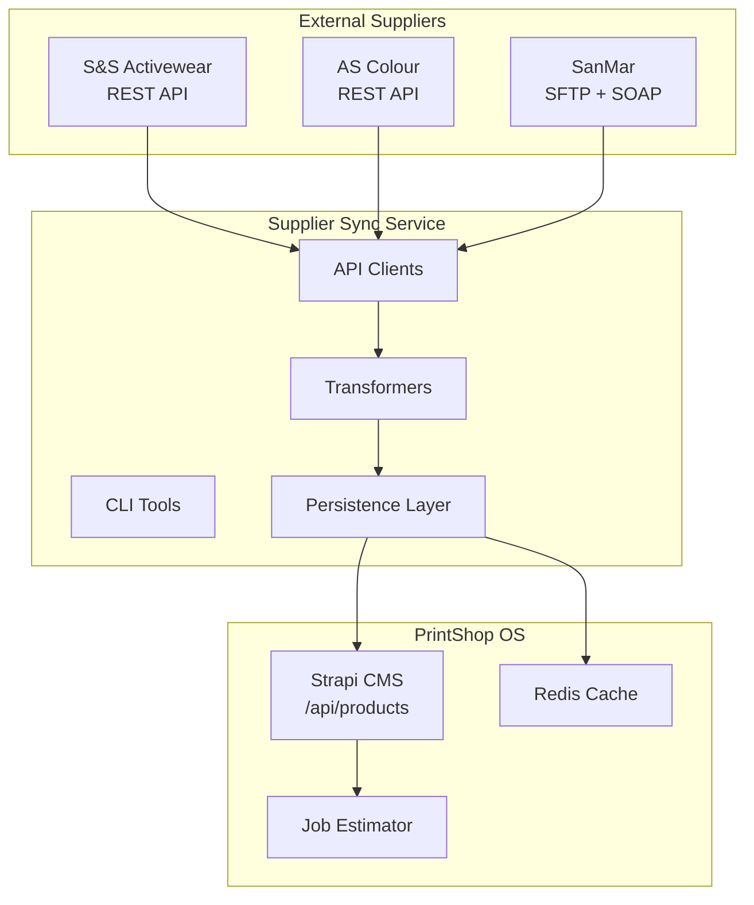
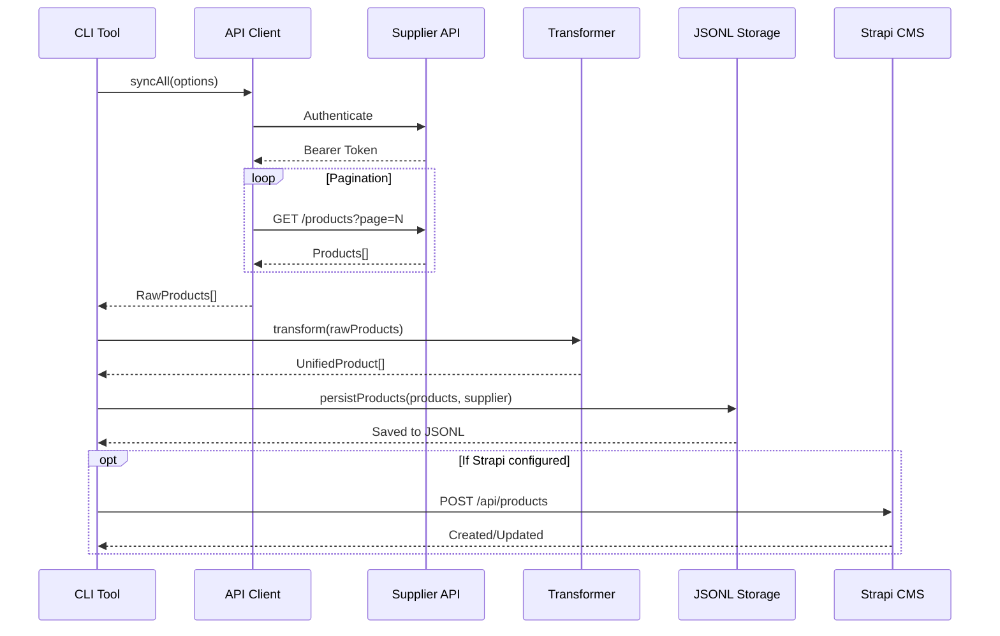
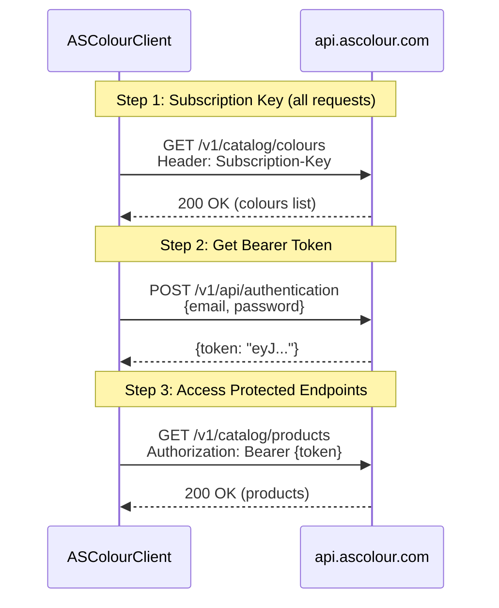

# Supplier Sync Service - Architecture Overview

**Last Updated:** November 27, 2025  
**Status:** Production Ready  
**Version:** 2.0.0

---

## System Context

The Supplier Sync Service integrates external apparel supplier catalogs into PrintShop OS. It normalizes disparate APIs (REST, SFTP, SOAP) into a unified product schema for downstream consumption by the pricing engine, quote system, and inventory display.



---

## Container Architecture

```
services/supplier-sync/
├── src/
│   ├── clients/                    # API Clients (one per supplier)
│   │   ├── as-colour.client.ts     # REST + Bearer Token auth
│   │   ├── ss-activewear.client.ts # REST + Basic auth
│   │   ├── sanmar-sftp.client.ts   # SFTP file download
│   │   └── sanmar.client.ts        # SOAP API (inventory)
│   │
│   ├── transformers/               # Data Normalization
│   │   ├── as-colour.transformer.ts
│   │   ├── ss-activewear.transformer.ts
│   │   └── sanmar-csv.transformer.ts
│   │
│   ├── cli/                        # Command-line Tools
│   │   ├── sync-as-colour.ts
│   │   ├── sync-ss-activewear.ts
│   │   └── sync-sanmar.ts
│   │
│   ├── persistence/                # Storage Layer
│   │   └── productPersistence.ts   # JSONL file storage
│   │
│   ├── services/                   # Shared Services
│   │   └── cache.service.ts        # Redis caching
│   │
│   ├── types/                      # TypeScript Types
│   │   └── product.ts              # UnifiedProduct schema
│   │
│   └── utils/                      # Utilities
│       └── logger.ts               # Winston logging
│
├── data/                           # Persisted Product Data
│   ├── ascolour/products.jsonl
│   ├── sanmar/products.jsonl
│   └── ss-activewear/products.jsonl
│
├── test-scripts/                   # Manual Testing
│   ├── test-ascolour-auth.ts
│   ├── test-sanmar-sftp.ts
│   └── explore-sftp.ts
│
├── tests/                          # Automated Tests
│   └── integration/
│
└── docs/                           # Documentation
    ├── suppliers/
    │   ├── ASCOLOUR.md
    │   └── SANMAR.md
    └── ADDING_NEW_SUPPLIER.md
```

---

## Key Workflows

### 1. Product Sync Flow



### 2. AS Colour Authentication Flow



---

## Data Contracts

### UnifiedProduct Schema

All suppliers transform to this common schema:

```typescript
interface UnifiedProduct {
  sku: string;              // "AC-1000" | "SS-G200" | "SM-PC61"
  name: string;             // Human-readable name
  brand: string;            // "AS Colour" | "Gildan" | "Port & Company"
  description: string;      // Product description
  category: ProductCategory; // "tshirts" | "hoodies" | "bags" | etc.
  supplier: SupplierName;   // "as-colour" | "ss-activewear" | "sanmar"
  
  variants: ProductVariant[];
  images: string[];
  
  pricing: {
    basePrice: number;
    currency: string;       // "USD"
    breaks?: PriceBreak[];  // Volume discounts
  };
  
  specifications?: {
    weight?: string;        // "180 GSM"
    fabric?: {
      type: string;         // "Cotton"
      content: string;      // "100% Airlume combed cotton"
    };
    features?: string[];
  };
  
  availability: {
    inStock: boolean;
    totalQuantity: number;
  };
  
  metadata: {
    supplierProductId: string;
    lastUpdated: Date;
    websiteURL?: string;
  };
}
```

### Supplier API Endpoints

| Supplier | Protocol | Auth Method | Rate Limit | Catalog Size |
|----------|----------|-------------|------------|--------------|
| **AS Colour** | REST | Subscription-Key + Bearer | ~100/min | 522 products |
| **S&S Activewear** | REST | Basic Auth | 120/min | 211K+ products |
| **SanMar** | SFTP + SOAP | Password | N/A (bulk) | 415K+ records |

---

## Error Handling

### HTTP Error Codes

| Code | Meaning | Retry Strategy |
|------|---------|----------------|
| 200 | Success | N/A |
| 301 | Redirect | Follow redirect |
| 400 | Bad Request | Do not retry |
| 401 | Unauthorized | Re-authenticate |
| 404 | Not Found | Return null/empty |
| 429 | Rate Limited | Exponential backoff |
| 500 | Server Error | Retry 3x with backoff |
| 503 | Service Unavailable | Retry 3x with backoff |

### Retry Logic

```typescript
// Exponential backoff: 1s, 2s, 4s
const delay = retryAfter || (retryDelayMs * attemptNumber);
await sleep(delay);
```

---

## Caching Strategy

| Data Type | TTL | Key Pattern |
|-----------|-----|-------------|
| Product Catalog | 24 hours | `products:{supplier}:all` |
| Individual Product | 24 hours | `product:{supplier}:{sku}` |
| Pricing | 1 hour | `pricing:{supplier}:{sku}` |
| Inventory | 15 minutes | `inventory:{supplier}:{sku}` |

**Why These TTLs:**
- Catalog: Products rarely change, reduces API calls by 95%
- Pricing: Volume discounts update daily, balance freshness vs cost
- Inventory: Real-time stock is critical for quotes, minimal caching

---

## Monitoring & Observability

### Logging

All operations log to:
- **Console**: Colorized, real-time
- `logs/combined.log`: All levels
- `logs/error.log`: Errors only

### Key Metrics (Future)

| Metric | Description |
|--------|-------------|
| `sync_duration_seconds` | Time to complete full sync |
| `products_synced_total` | Products successfully synced |
| `api_errors_total` | API errors by supplier/code |
| `cache_hit_rate` | Redis cache effectiveness |

---

## Information Requested

- **TBD**: SanMar SOAP endpoint behavior for inventory updates
- **TBD**: S&S Activewear image URL patterns for high-res downloads
- **TBD**: Redis deployment for production (docker-host vs external)

---

<small>Generated with GitHub Copilot as directed by @ronnyworks</small>
